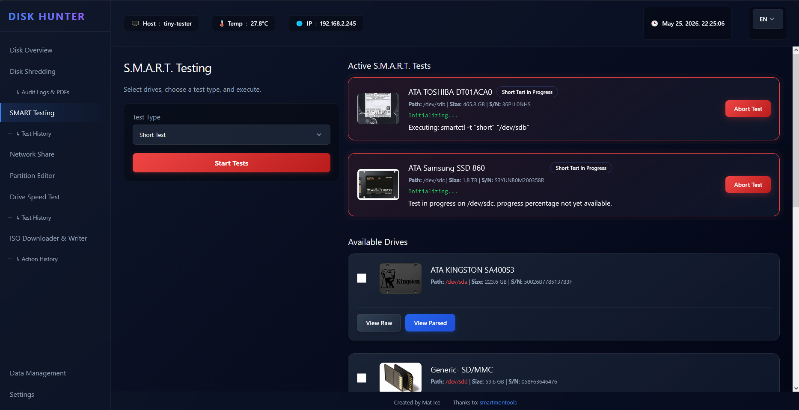
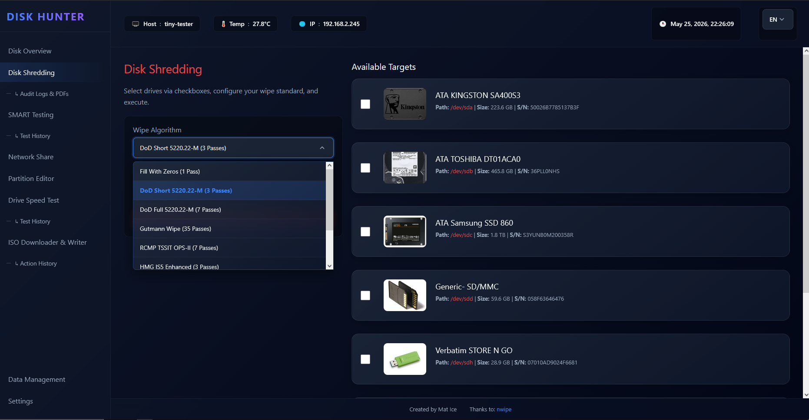
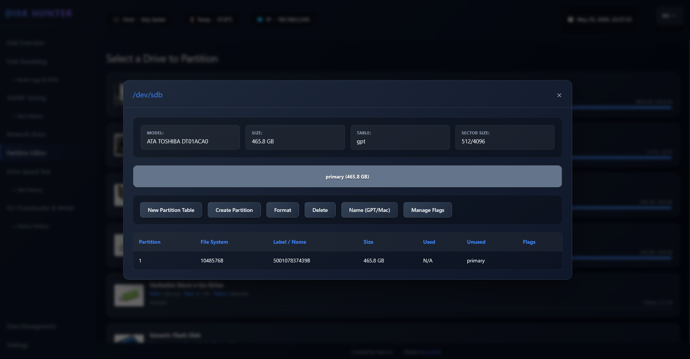
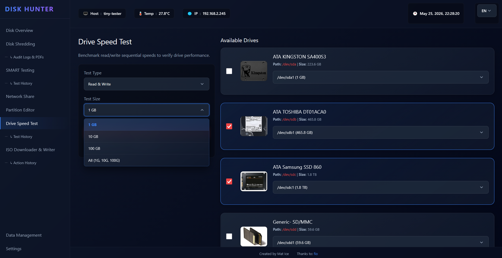
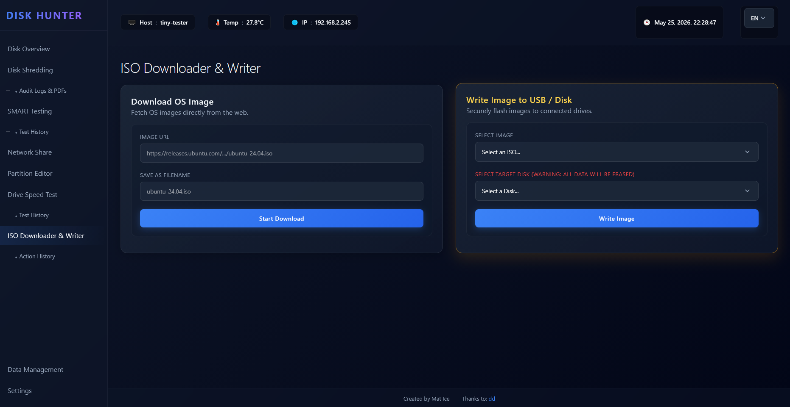
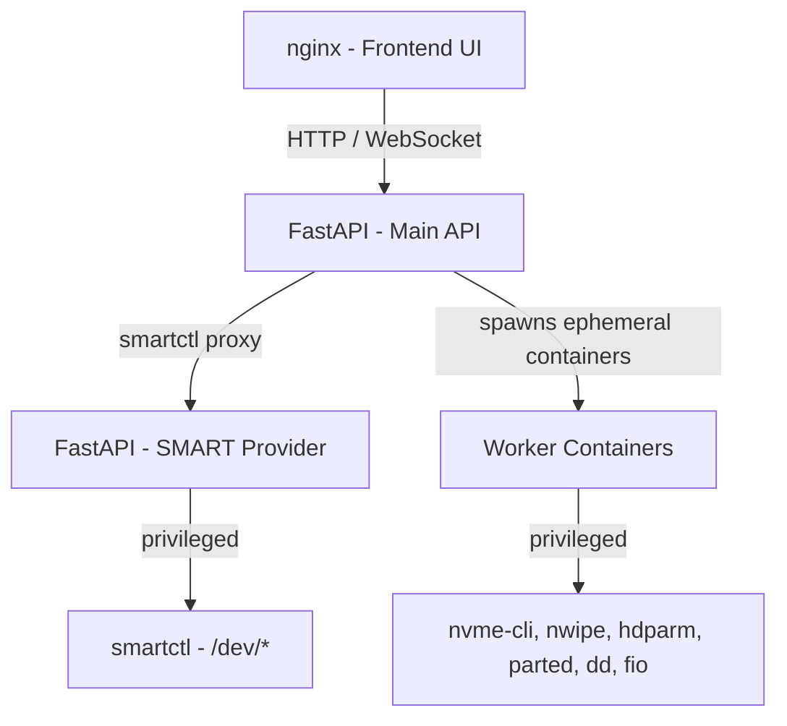

# Disk Hunter

> **An all-in-one web utility for testing, managing, wiping, and formatting physical storage drives.**

Disk Hunter provides a glassmorphic dashboard for administrative disk operations. A Python FastAPI backend orchestrates root-level commands inside ephemeral privileged Docker containers, keeping the host system isolated from destructive operations.

---

<div align="center">
  <table>
    <tr>
      <td align="center">
        <br>
        <b>SMART Test</b>
      </td>
      <td align="center">
        <br>
        <b>Disk Shredding</b>
      </td>
    </tr>
    <tr>
      <td align="center">
        <br>
        <b>Partition Editor</b>
      </td>
      <td align="center">
        <br>
        <b>Speed Test</b>
      </td>
    </tr>
    <tr>
      <td align="center" colspan="2">
        <br>
        <b>ISO Module</b>
      </td>
    </tr>
  </table>
</div>

## Key Features

- **Interactive Dashboard** — View connected drives, partition structures, device health, and hardware specs in a unified grid. List and squares layouts with drive image lightbox.
- **Secure Wiping** — Erase drives via `nwipe` (DoD 5220.22-M, Gutmann, PRNG, zero fill), `hdparm` ATA Secure Erase (standard + enhanced), or `nvme-cli` NVMe format (crypto + user-data erase). Real-time log streaming and automatic PDF Certificate of Erasure generation.
- **ATA Frozen Drive Handling** — Multi-method unfreeze (ATA sleep/wake, SATA link-power cycle, SCSI device-state reset) with automatic fallback to block-level zero overwrite (NIST SP 800-88 Clear) when the drive stays frozen.
- **Speed Benchmarks** — Sequential read/write `fio` benchmarks directly from the UI with history tracking.
- **S.M.A.R.T. Diagnostics** — Run short/extended self-tests, monitor real-time progress, and view structured attribute health tables.
- **Visual Partition Editor** — Create, delete, and format partitions (ext3, ext4, fat32, ntfs) with batch operations and a partition graphic.
- **OS Image Flashing** — Download and write `.iso` / `.img` files to targeted devices.
- **Temperature Monitoring** — Multi-sensor thermal page with configurable thresholds, colour-coded readings, and server-side settings.
- **Air-Gapped Kiosk Mode** — Optional Firefox ESR kiosk container for bare-metal deployments with no desktop environment.
- **Onboard Help Center** — Modular Markdown guides with localized translations.
- **Glassmorphic UI** — Consistent dark mode design with custom modals, responsive layout, and a Potato Mode toggle for low-end hardware.

---

## System Architecture



| Component | Container | Role |
|-----------|-----------|------|
| **Frontend** | `disk-hunter-ui` | Vanilla HTML/CSS/JS served by nginx |
| **Main API** | `disk-hunter-api` | FastAPI orchestrator — spawns, monitors, and terminates worker containers via Docker |
| **SMART Provider** | `disk-hunter-smart-provider` | Privileged FastAPI microservice — proxy for `smartctl` queries |
| **Workers** | `disk-hunter-*` | Ephemeral single-purpose containers (`nwipe`, `hdparm`, `nvme-cli`, `parted`, `smartctl`, `fio`) |

All base images are digest-pinned and all packages are version-locked to prevent supply chain attacks.

---

## Directory Layout

```
.
├── backend/                   # FastAPI orchestrator
│   ├── api/                   # Router modules (disks, shredding, history, partition, etc.)
│   └── Dockerfile
├── html/                      # Frontend served by nginx
│   ├── css/                   # Glassmorphism theme stylesheets
│   ├── js/                    # Page logic and shared helpers
│   ├── components/            # Header, footer, sidebar fragments
│   └── docs/                  # On-site help center Markdown
├── smart-provider/            # SMART data microservice
├── workers/                   # Ephemeral task containers
│   ├── hdparm/                # ATA secure erase
│   ├── nvme/                  # NVMe format / crypto erase
│   ├── nwipe/                 # DBAN-based multi-pass eraser
│   ├── parted/                # Partition management
│   ├── smartctl-test/         # SMART self-test runner
│   ├── speedtest-worker/      # fio benchmark runner
│   └── firefox-kiosk/         # Air-gapped kiosk mode (compose profile)
├── data/                      # Runtime logs, PDFs, caches (gitignored)
├── docker-compose.yml
├── .env.example               # Configuration template
└── nginx-entrypoint.sh        # SSL / routing startup script
```

---

## Quick Start

### Prerequisites

- Linux host with Docker and Docker Compose
- Physical drive access (`/dev`, `/sys`, `/run/udev` are bind-mounted)
- Root or sudo access for Docker

### Deploy

```bash
git clone <repo-url> Disk-Hunter
cd Disk-Hunter
cp .env.example .env   # Edit if needed
docker compose up -d --build
```

The dashboard is available at `http://localhost` (or the host's IP on port 80/443 if HTTPS is configured).

---

## Configuration

All configuration is via `.env` (copy from `.env.example`). Docker Compose reads it automatically.

### Feature Toggles

| Variable | Description | Default |
|----------|-------------|---------|
| `ALLOWED_IPS` | Comma-separated allowed client IPs, or `*` for any | `*` |
| `ENABLE_SHREDDER` | Disk shredding (nwipe, hdparm, nvme) | `true` |
| `ENABLE_SPEEDTEST` | fio speed benchmarks | `true` |
| `ENABLE_ISOWRITER` | ISO download and flashing | `true` |
| `ENABLE_SMARTCTL` | SMART self-testing and analytics | `true` |
| `ENABLE_DATA_MANAGEMENT` | PDF/ISO/data file browsing | `true` |
| `ENABLE_NETWORK_SHARE` | Network share module (frontend toggle) | `true` |
| `ENABLE_DELETE_HISTORY` | Allow log/history deletion; `false` for immutable audits | `true` |
| `DATA_DIR` | Host path for logs, PDFs, and metadata | `./data` |

### HTTPS

Set `HTTPS_CERT_PATH` and `HTTPS_KEY_PATH` to your SSL certificate and key. nginx handles TLS automatically.

### ATA Secure Erase

| Variable | Description | Default |
|----------|-------------|---------|
| `FROZEN_FALLBACK_WIPE` | `1` = fall back to block-level zero overwrite if drive stays frozen; `0` = hard-fail | `1` |

### Kiosk Mode

| Variable | Description | Default |
|----------|-------------|---------|
| `KIOSK_URL` | URL for the Firefox kiosk to open | `http://localhost` |

### Server-Side Settings

Branding (company name, address, phone, datacenter tags), temperature sensor selection, and temperature collection are persisted in `data/branding.json` and `data/app_settings.json` on the Disk Hunter machine, shared across all clients.

### Applying Changes

```bash
docker compose down
docker compose up -d --build --force-recreate
```

---

## Air-Gapped Kiosk Mode

For bare, air-gapped Linux hosts with no desktop environment, an optional Firefox kiosk container launches a self-contained X server on the host's **tty2** and opens Firefox ESR in fullscreen kiosk mode at the Disk Hunter UI.

```bash
docker compose --profile kiosk up -d --build
```

Switch to tty2 with `Ctrl+Alt+F2` (or the container runs `chvt 2` automatically). 

---

## Supply Chain Security

All Docker base images are pinned by SHA256 digest and all APK/pip packages are locked to exact versions. Floating tags can be repointed upstream to a compromised or broken image without notice — digest pinning eliminates that risk. Version lock variables are defined in `.env.example` and passed as build args to every Dockerfile.

---

## TODO

- Active Directory / LDAP integration with role-based access control
- Automated SMTP emailing of PDF erasure certificates
- Bulk firmware updates across uniform drive batches
- Network share / disk browsing module
- Default drive images for nvme / usb / ssd / hdd / sd
- Debian APT package pinning (backend, smart-provider, nwipe, firefox-kiosk)
- Authentication on API endpoints

---

## Recent Updates

- Fixed the ATA frozen drive issue by adding multi-method unfreezing and a fallback to block-level zero wipe
- Fixed the "Select All" bug in shredding so it actually populates the selected drives list now
- Added NVMe secure erase with a fallback to user-data erase
- Huge security hardening pass: added server-side drive validation, path traversal fixes, command injection guards, and better root-disk protection
- Added a new multi-sensor temperature monitoring page with server-side config
- Pinned supply chain dependencies and consolidated the versions file into .env
- Assorted other changes from before like the partition editor redesign, kiosk mode, and websocket optimizations
