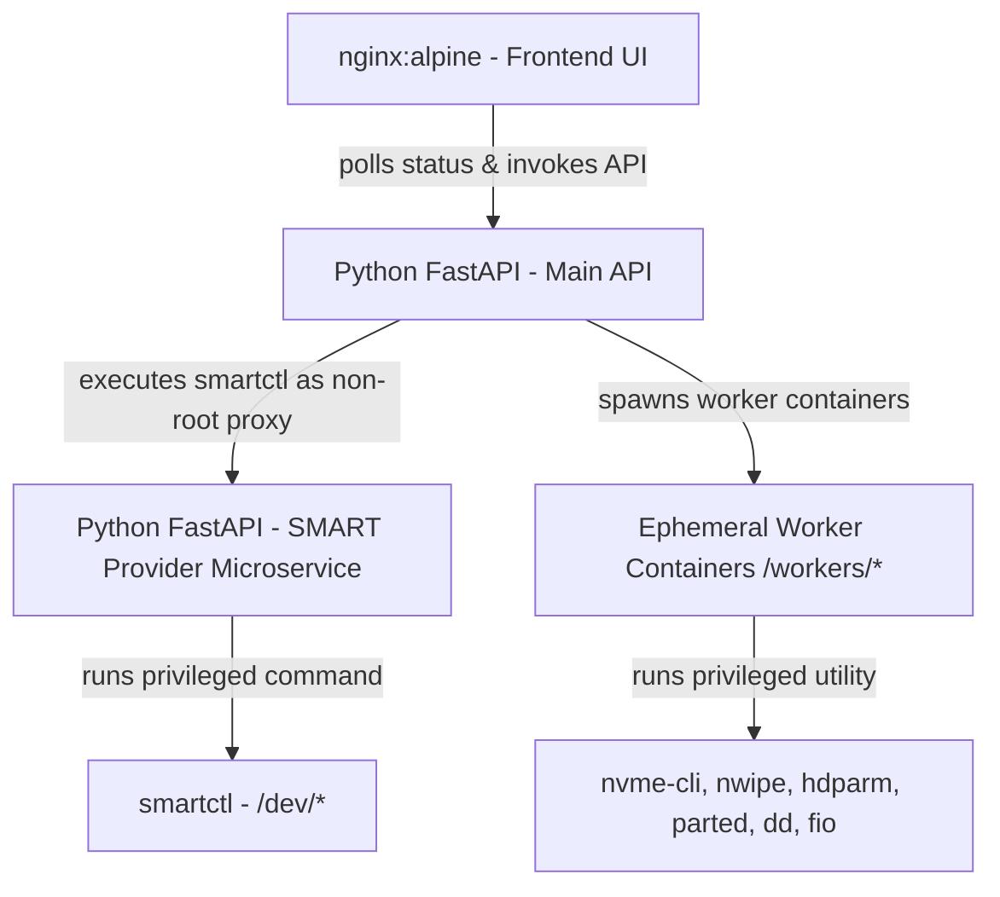

# Disk Hunter

> **An all-in-one, web utility designed for testing, managing, wiping, and formatting physical storage drives.**

Disk Hunter provides a sleek, modern glassmorphic dashboard interface for administrative disk operations. It leverages a high-performance Python FastAPI backend, isolating root-level, privileged commands inside ephemeral Docker containers to safeguard host system integrity.

---

## Key Features

- **Interactive Dashboard:** Instantly view connected drives, partition structures, device health, and raw hardware specs in a unified grid.
- **Secure Wiping (Shredder):** Erase disk data using industry-standard wiping methods (via `nwipe` and `hdparm`). Streams real-time terminal output to the browser and automatically generates a PDF **Certificate of Erasure** upon completion.
- **Speed Benchmarks:** Run sequential read/write speed tests (using `fio` benchmarks) directly from the UI.
- **S.M.A.R.T. Diagnostics:** Run and monitor short/extended self-tests, check real-time progress metrics, and view structured attribute health tables.
- **Visual Partition Editor:** Create, delete, and format partitions (ext3, ext4, fat32, ntfs) with an intuitive click-and-drag block interface powered by `parted`.
- **OS Image Flashing:** Safely write downloaded `.iso` or `.img` OS installations directly to targeted devices.

---

## System Architecture

Disk Hunter is built with a decoupled microservice layout to ensure **Worker Isolation** and **Concurrency Safety**:



1. **Frontend (`disk-hunter-ui`):** A responsive, glassmorphic UI built in vanilla HTML, CSS (no Tailwind), and JavaScript, served via Nginx.
2. **Main API (`disk-hunter-api`):** The orchestration hub. Spawns, monitors, and terminates ephemeral Docker worker containers via async subprocess calls.
3. **SMART Provider (`disk-hunter-smart-provider`):** A lightweight FastAPI microservice running in privileged mode. Acts as a secure proxy to query disk S.M.A.R.T data without elevating the main API's privileges.
4. **Task Workers (`/workers/`):** Ephemeral containers build contexts containing single-purpose utilities (`nwipe`, `smartctl`, `parted`, `fio`, `dd`, etc.).

---

## Restructured Directory Layout

```
.
├── backend/                   # Main FastAPI orchestrator application
│   ├── api/                   # Router modules (disks, shredding, history, partition, etc.)
│   └── Dockerfile             # Main API container definition
├── html/                      # Frontend web files served by Nginx
│   ├── css/                   # Global and page-specific stylesheets (glassmorphism theme)
│   ├── js/                    # Dashboards, modals, and common web helpers
│   └── components/            # Reusable header, footer, and sidebar fragments
├── smart-provider/            # Dedicated SMART data microservice
├── workers/                   # Ephemeral task containers (restructured)
│   ├── hdparm/                # ATA secure erase tools
│   ├── nvme/                  # NVMe utilities
│   ├── nwipe/                 # DBAN-based disk eraser container
│   ├── parted/                # Disk partition manager
│   ├── smartctl-test/         # S.M.A.R.T diagnostics runner
│   └── speedtest-worker/      # fio speed benchmarking tool
├── data/                      # Persistent runtime logs, PDFs, caches (Git ignored)
├── docker-compose.yml         # Container deployment configuration
└── nginx-entrypoint.sh        # Startup script to dynamically configure SSL/HTTPS and routing
```

---

## Configuration (`.env`)

Disk Hunter uses environment variables to manage access permissions, data paths, and feature toggles:

| Variable | Description | Default |
|----------|-------------|---------|
| `ALLOWED_IPS` | Comma-separated list of allowed client IP addresses (or `*` for any) | `*` |
| `ENABLE_SHREDDER` | Enables/Disables disk shredding features | `true` |
| `ENABLE_SPEEDTEST` | Enables/Disables sequential read/write speed benchmarking | `true` |
| `ENABLE_ISOWRITER` | Enables/Disables ISO downloading and flashing | `true` |
| `ENABLE_SMARTCTL` | Enables/Disables S.M.A.R.T self-testing and analytics | `true` |
| `ENABLE_DATA_MANAGEMENT` | Enables/Disables internal PDF/ISO data browsing | `true` |
| `ENABLE_DELETE_HISTORY` | Hides log deletion buttons when `false` for immutable audits | `false` |
| `DATA_DIR` | Absolute path on host to store logs, PDFs, and metadata | `./data` |

To apply configuration changes, restart the services:
```bash
docker compose down
docker compose up -d --build --force-recreate
```

---

## Quick Start

1. Clone this repository.

2. Boot the environment using Docker Compose:
   ```bash
   docker compose up -d --build
   ```
3. Access the web dashboard at `http://localhost` (or the configured IP : HTTPS port).

---

## TODO / Future Features

- **Onboard Documentation:** Add interactive, embedded help guides, tooltips, and documentation pages directly inside the web UI for on-site technicians.
- **Active Directory / LDAP Integration:** Corporate user authentication and role-based access control (RBAC).
- **Native NVMe Secure Erase Support:** Expand nvme-cli worker support to trigger hardware block formatting.
- **Automated Report Emailing:** SMTP mailing service to dispatch PDF erasure certificates automatically.
- **Bulk Firmware Updates:** Automate deploying vendor-specific firmware images across uniform drive batches.
- **Disk Overview** Fix the fetching of smartdata always being called every refresh 
- **Natework share / Disk browsing** Maybe make the module for drive browsing 
- **Drive images fix** add default images for nvme / usb / ssd / hdd / sd...
- **Security** do an audit on the whole code base 
- **Pin package Versions** Lock all Python modules and APT package versions to reduce the risk and impact of vulnerabilities introduced in newer package releases.
